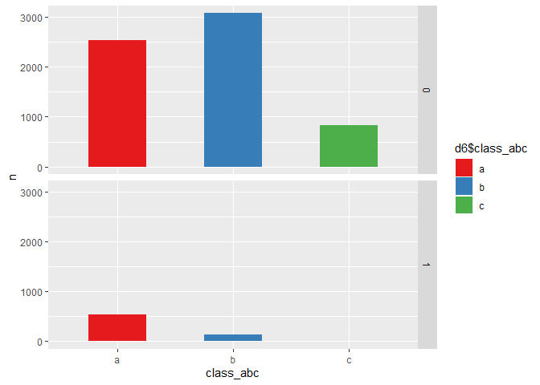
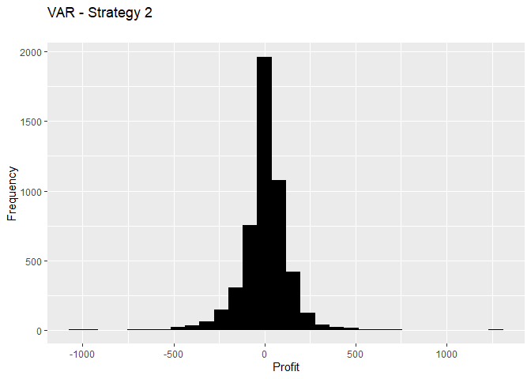
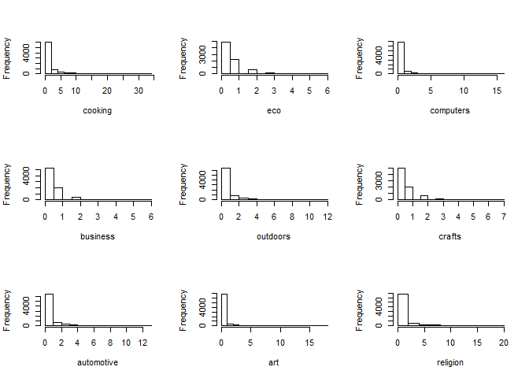

STA380 Exercise
================

# \*\* Question 1: Visual story telling part 1: green buildings:\*\*

First step is to read in the data and summarize it. We also check for
missing values

<table>

<thead>

<tr>

<th style="text-align:left;">

</th>

<th style="text-align:right;">

x

</th>

</tr>

</thead>

<tbody>

<tr>

<td style="text-align:left;">

CS\_PropertyID

</td>

<td style="text-align:right;">

0

</td>

</tr>

<tr>

<td style="text-align:left;">

cluster

</td>

<td style="text-align:right;">

0

</td>

</tr>

<tr>

<td style="text-align:left;">

size

</td>

<td style="text-align:right;">

0

</td>

</tr>

<tr>

<td style="text-align:left;">

empl\_gr

</td>

<td style="text-align:right;">

74

</td>

</tr>

<tr>

<td style="text-align:left;">

Rent

</td>

<td style="text-align:right;">

0

</td>

</tr>

<tr>

<td style="text-align:left;">

leasing\_rate

</td>

<td style="text-align:right;">

0

</td>

</tr>

<tr>

<td style="text-align:left;">

stories

</td>

<td style="text-align:right;">

0

</td>

</tr>

<tr>

<td style="text-align:left;">

age

</td>

<td style="text-align:right;">

0

</td>

</tr>

<tr>

<td style="text-align:left;">

renovated

</td>

<td style="text-align:right;">

0

</td>

</tr>

<tr>

<td style="text-align:left;">

class\_a

</td>

<td style="text-align:right;">

0

</td>

</tr>

<tr>

<td style="text-align:left;">

class\_b

</td>

<td style="text-align:right;">

0

</td>

</tr>

<tr>

<td style="text-align:left;">

LEED

</td>

<td style="text-align:right;">

0

</td>

</tr>

<tr>

<td style="text-align:left;">

Energystar

</td>

<td style="text-align:right;">

0

</td>

</tr>

<tr>

<td style="text-align:left;">

green\_rating

</td>

<td style="text-align:right;">

0

</td>

</tr>

<tr>

<td style="text-align:left;">

net

</td>

<td style="text-align:right;">

0

</td>

</tr>

<tr>

<td style="text-align:left;">

amenities

</td>

<td style="text-align:right;">

0

</td>

</tr>

<tr>

<td style="text-align:left;">

cd\_total\_07

</td>

<td style="text-align:right;">

0

</td>

</tr>

<tr>

<td style="text-align:left;">

hd\_total07

</td>

<td style="text-align:right;">

0

</td>

</tr>

<tr>

<td style="text-align:left;">

total\_dd\_07

</td>

<td style="text-align:right;">

0

</td>

</tr>

<tr>

<td style="text-align:left;">

Precipitation

</td>

<td style="text-align:right;">

0

</td>

</tr>

<tr>

<td style="text-align:left;">

Gas\_Costs

</td>

<td style="text-align:right;">

0

</td>

</tr>

<tr>

<td style="text-align:left;">

Electricity\_Costs

</td>

<td style="text-align:right;">

0

</td>

</tr>

<tr>

<td style="text-align:left;">

cluster\_rent

</td>

<td style="text-align:right;">

0

</td>

</tr>

</tbody>

</table>

Thus we can see that only emp\_gr column has missing values.

Next we check to see if there are outliers in the rent for green and
non-green buildings.
<!-- -->

From the above plot we can see that the rent for non-green building
might be skewed due to many outliers above 50 and so we look at the
median rents. The median rent for green buildings is higher than
non-green buildings by (27.6-25) = **2.6$/sqft**

Now let us check how the leasing rate affects the rent for green and non
green buildings:
<!-- -->

There seems to be a high concentration between 0-10%. Let’s plot the
leasing rate separately for green and non green:
<!-- --><!-- -->

Thus we see, for non-green buildings, there are **leasing rates less
than 10%**. Let us ignore these buildings as we have to compare with
green buildings:

Since most green- buildings are young, rent should be higher than
non-green buildings. First, let us plot the number of green and
non-green buildings based on age:
<!-- -->

In general there are more non green buildings than green buidings and
they are also older than the green buildings

Now, let us plot the mean age for green vs non green:
<!-- -->

Only in the first 10 years the avg rent of green buildings is higher
than non-green. Additionally, as the age is increasing, rent for green
is increasing, but decreasing for non- green buildings.

Now, let us also consider the leasing rate. We will plot the occupancy
rate in green and non-green buildings according to age:
<!-- -->

In general the mean leasing rate is more for green buildings than
non-green and is above 80%. Let us find the mean leasing rate of green
and non-green buildings:

The average leasing rate for green buildings is **89.4690045** and that
of non-green building is **85.0593375**.

This implies that even though the initial cost are higher for a green
building, in years to come the rent as well as the leasing rate will be
higher for green buildings, thus allowing us the get a ROI.

Now let us look at what role class plays here. Let us plot the number of
buildings vs classes:
<!-- -->

We see that most of the green buildings belong to class A and there are
more class B non-green buildings than Class A

Let us plot class vs Rent. We see that the rent of class A buildings
have a higher rent
<!-- -->

We can see that if the building is in class A, the rent will be higher
irrespective of whether it is a green building or not.

Let us see the numbers now:

The rent obtained from a green building, considering average leasing
rate is:

We find the excess rent that we would get from a green building to be
**$8.571527210^{5}**.

Thus, considering the $5M additional charge that goes into a green
building, we would take **5.8332662** years to recover the extra cost.

Let us keep in mind that the rent as well as leasing rate increases for
green buildings as it gets older and hence we agree with the excel
expert that it will be a good financial decision to build a green
building.

# 

# \*\* Question 2: Visual story telling part 2: flights at ABIA:\*\*

## PROBLEM DESCRIPTION:

#### We are given the data for flights at Austin Airport, do EDA and produce some interesting findings

#### Installing the necessary libraries

## Reading the files Abia and airport codes

#### Data Cleaning and Manupulation

## Adding another column “day\_phase” and “day\_phase\_arr” which groups the deperature time and arrival time into following groups:

#### If time is between 0:00 to 6:00 then its early morning

#### If time is between 6:00 to 12:00 then its is morning

#### If the time is between 12:00 to 15:00 then it is afternoon

#### If the time is between 15:00 to 20:00 then it is evening

#### from 20:00 to 0:00 it is night

#### Plotting a map with delays

Tried using ggmap but in order to use it, the console is telling me to
register with a google API and while requesting it from
<https://cloud.google.com/maps-platform/> , it is asking for billing
information. Tried mapping with locations but it is unable to fetch the
files from source Moving ahead and doing EDA on ABIA data only

The unique carriers
    are:

    ##  [1] "9E" "AA" "YV" "NW" "CO" "XE" "B6" "WN" "UA" "OO" "OH" "EV" "US" "MQ"
    ## [15] "F9" "DL"

The unique origins
    are:

    ##  [1] "MEM" "AUS" "MCI" "LAX" "ELP" "JFK" "ORD" "MSY" "SAN" "IAH" "ATL"
    ## [12] "DFW" "IAD" "LAS" "CLE" "BWI" "BOS" "ONT" "LBB" "TPA" "DAL" "PHX"
    ## [23] "ABQ" "SFO" "JAX" "SJC" "MCO" "CVG" "SLC" "HOU" "DEN" "BNA" "STL"
    ## [34] "HRL" "EWR" "OKC" "TUL" "SNA" "MAF" "TUS" "RDU" "MSP" "MDW" "SAT"
    ## [45] "TYS" "BHM" "PHL" "SEA" "LGB" "FLL" "IND" "CLT" "OAK"

## Plotting total number of flights per carrier and operating per airport

<!-- -->

We can see that the my carrier “WN” has one of the busiest flights
having most number of them departing from Austin. By checking on google,
it tells me these are South West
Airlines.

#### Finding out the average delay time in departure from Austin Airport per carrier per phase of the day

<!-- -->

We can see that : \#\#\#\# Finding out the average delay time in
departure from Austin Airport per carrier per phase of the day
<!-- -->

In the plot above, the grid is telling me at each day of week, what is
the average delay time of my carriers in different phases of the day. We
can see that generally, the nights have the major delays in departures
at the Austin Airports
.

#### Filtering for arrivals to Austin Airport and running the analysis again

<!-- -->

We can see from the plot above that generally flights coming at early
morning tend to arrive late.

## Plotting some extra graphs to see further general trends:

<!-- -->

We can see that the flights between IAD and AUS are the ones which fly
on regular basis and are constantly delayed. Perhaps upon increasing the
number of flights or changing the routes might solve the
problem.

#### Plotting average delay and number of flights based on monthly basis:

<!-- -->

## Conclusion :

  - The “South West Airlines” has majority of carriers operating at the
    Austin Airport.

  - Generally, at any given day of the week, the departures at the Early
    Morning (till 6am) are the busiest for Arrivals, and at Evenings,
    its the departures which are delayed the most. So if you are
    travelling from Austin, avoid booking an evening flight and if you
    are travelling to Austin, try to avoid a flight which arrives early
    morning.

  - Generally, the airline service between Dulles, Washington (IAD) and
    Austin is generally delayed. Probably increasing the number of
    aircrafts might change the scenario.

# 

# \*\* Question 3: Portfolio modeling: \*\*

First let us import few stocks. We will choose stocks such that few are
volatile and few are stable. Also we chose stocks which have more than 5
years of data.

1.  Find stocks to put in your EFT
2.  Plot the trends for the past 5 years to see which ones are volatile
    and which ones are stable
3.  Decide the weightes for all 3 portfolios
4.  Create a function to calculate the VAR at the end of 4 weeks
    Function:
5.  Build a loop to resample the returns day by day and add a
    rebalancing at the end of the loop
6.  Build another loop to perform monte carlo simulations

Stocks were selected from the top 100 most heavily traded exchange
products.

``` r
mystocks = c("EEM", "QQQ", "SPY", "EFA", "XOP")
getSymbols(mystocks)
```

    ## 'getSymbols' currently uses auto.assign=TRUE by default, but will
    ## use auto.assign=FALSE in 0.5-0. You will still be able to use
    ## 'loadSymbols' to automatically load data. getOption("getSymbols.env")
    ## and getOption("getSymbols.auto.assign") will still be checked for
    ## alternate defaults.
    ## 
    ## This message is shown once per session and may be disabled by setting 
    ## options("getSymbols.warning4.0"=FALSE). See ?getSymbols for details.

    ## [1] "EEM" "QQQ" "SPY" "EFA" "XOP"

To adjust for splits and divedends, we use the adjustOLHC package which
is part of the quantmod() library.

    ##     ClCl.EEM             ClCl.QQQ             ClCl.SPY         
    ##  Min.   :-0.1616620   Min.   :-0.0895567   Min.   :-0.0984477  
    ##  1st Qu.:-0.0085599   1st Qu.:-0.0047393   1st Qu.:-0.0039585  
    ##  Median : 0.0007642   Median : 0.0009900   Median : 0.0005546  
    ##  Mean   : 0.0001969   Mean   : 0.0005451   Mean   : 0.0003005  
    ##  3rd Qu.: 0.0089960   3rd Qu.: 0.0068660   3rd Qu.: 0.0055316  
    ##  Max.   : 0.2276986   Max.   : 0.1216475   Max.   : 0.1451977  
    ##     ClCl.EFA             ClCl.XOP         
    ##  Min.   :-1.116e-01   Min.   :-0.1796222  
    ##  1st Qu.:-5.692e-03   1st Qu.:-0.0121723  
    ##  Median : 5.797e-04   Median : 0.0006704  
    ##  Mean   : 5.354e-05   Mean   : 0.0001221  
    ##  3rd Qu.: 6.549e-03   3rd Qu.: 0.0130152  
    ##  Max.   : 1.589e-01   Max.   : 0.2191988

``` r
#par(mfrow = c(3, 2))
colours = c('dark red', 'dark cyan','blue','dark green','orange')
for (i in seq_along(mystocks)) {
  df_expr = paste(mystocks[i],"$",mystocks[i],".Close", sep = "")
  data = eval(parse(text = df_expr))
  plot = plot(data, col = colours[i], type = "l", main = paste(mystocks[i],"Closing Prices"))
  print(plot)
}
```

<!-- --><!-- --><!-- --><!-- --><!-- -->

Let us look at the standard deviation to judge the volatility

``` r
stdev_stocks = data.frame()
for (i in 1:ncol(all_returns))
{
 s = sd(all_returns[, i], na.rm = T)
 stdev_stocks[1,i] =  s
}
colnames(stdev_stocks) = colnames(all_returns)
stdev_stocks
```

    ##     ClCl.EEM  ClCl.QQQ   ClCl.SPY   ClCl.EFA   ClCl.XOP
    ## 1 0.01943089 0.0131662 0.01229771 0.01455373 0.02406699

Looks like **EEM** and **XOP** are the most volatile stocks.

Now to build the function to calculate the variance:

``` r
days = 20
initial_wealth = 10000
func_wealthtracker = function(weights){
  wealthtracker = matrix(0, nrow = 5000, ncol = days)
  for (i in 1:5000) {
  wealth = initial_wealth
    for (day in 1:20) {
      wealth = initial_wealth
      splits = weights*wealth
      sample.day = resample(all_returns, 1, orig.ids = FALSE)
      return = splits+splits*sample.day
      wealth = sum(return)
      wealthtracker[i,day] <- wealth
    }}
  wealthtracker
}
```

``` r
#plot the histogram for the first portfolio
weights1 = c(0.2, 0.2, 0.2, 0.2, 0.2)
data1 = func_wealthtracker(weights1)
ggplot(mapping = aes(data1[,days]-initial_wealth)) +
  geom_histogram(bins = 30, fill = 'black') +
  labs(x = "Profit",
       y = "Frequency",
       title = "VAR - Strategy 1",
       subtitle = "")
```

<!-- -->

``` r
quantile(data1[,days] - initial_wealth, 0.05)
```

    ##        5% 
    ## -244.9361

Thus, from a portfolio where the weights are evenly distributed, we get
a VAR of -244.9361048. Additionally, we get an average profit of
1.000210^{4}.

Now let us see a safer portfolio, where we put lesser weight on the 2
volatile stocks

``` r
weights2 = c(0.05, 0.3, 0.3, 0.3, 0.05)
data2 = func_wealthtracker(weights2)
ggplot(mapping = aes(data2[,days]-initial_wealth)) +
  geom_histogram(bins = 30, fill = 'black') +
  labs(x = "Profit",
       y = "Frequency",
       title = "VAR - Strategy 2",
       subtitle = "")
```

<!-- -->

``` r
quantile(data2[,days] - initial_wealth, 0.05)
```

    ##        5% 
    ## -208.8619

Thus, from a safer portfolio, we get a VAR of **-208.8618568**.
Additionally, we get an average profit of **1.000410^{4}**.

Next, we will make a more risky portfolio, adding weight on the more
volatile stocks

``` r
weights3 = c(0.25, 0.2, 0.2, 0.1, 0.25)
data3 = func_wealthtracker(weights2)
ggplot(mapping = aes(data3[,days]-initial_wealth)) +
  geom_histogram(bins = 30, fill = 'black') +
  labs(x = "Profit",
       y = "Frequency",
       title = "VAR - Strategy 3",
       subtitle = "")
```

<!-- -->

``` r
quantile(data3[,days] - initial_wealth, 0.05)
```

    ##        5% 
    ## -207.8457

Thus, from a safer portfolio, we get a VAR of **-207.845651**.
Additionally, we get an average profit of
**1.000110^{4}**.

# 

# \*\* Question 4: Market Segmentation:\*\* \#\# PROBLEM UNDERSTANDING: We are supposed to analyze our data and cluster it based on the customers online activity so that our client can approach the market in a more segmented fashion \#\#\#\# Loading libraries

## EDA on DATA:

#### Plotting summaries and checking for null values in each of the columns

    ##  [1] X                chatter          current_events   travel          
    ##  [5] photo_sharing    uncategorized    tv_film          sports_fandom   
    ##  [9] politics         food             family           home_and_garden 
    ## [13] music            news             online_gaming    shopping        
    ## [17] health_nutrition college_uni      sports_playing   cooking         
    ## [21] eco              computers        business         outdoors        
    ## [25] crafts           automotive       art              religion        
    ## [29] beauty           parenting        dating           school          
    ## [33] personal_fitness fashion          small_business   spam            
    ## [37] adult           
    ## <0 rows> (or 0-length row.names)

    ## [1] "unique ids"

    ##          X           chatter       current_events      travel      
    ##  123pxkyqj:   1   Min.   : 0.000   Min.   :0.000   Min.   : 0.000  
    ##  12grikctu:   1   1st Qu.: 2.000   1st Qu.:1.000   1st Qu.: 0.000  
    ##  12klxic7j:   1   Median : 3.000   Median :1.000   Median : 1.000  
    ##  12t4msroj:   1   Mean   : 4.399   Mean   :1.526   Mean   : 1.585  
    ##  12yam59l3:   1   3rd Qu.: 6.000   3rd Qu.:2.000   3rd Qu.: 2.000  
    ##  132y8f6aj:   1   Max.   :26.000   Max.   :8.000   Max.   :26.000  
    ##  (Other)  :7876                                                    
    ##  photo_sharing    uncategorized      tv_film      sports_fandom   
    ##  Min.   : 0.000   Min.   :0.000   Min.   : 0.00   Min.   : 0.000  
    ##  1st Qu.: 1.000   1st Qu.:0.000   1st Qu.: 0.00   1st Qu.: 0.000  
    ##  Median : 2.000   Median :1.000   Median : 1.00   Median : 1.000  
    ##  Mean   : 2.697   Mean   :0.813   Mean   : 1.07   Mean   : 1.594  
    ##  3rd Qu.: 4.000   3rd Qu.:1.000   3rd Qu.: 1.00   3rd Qu.: 2.000  
    ##  Max.   :21.000   Max.   :9.000   Max.   :17.00   Max.   :20.000  
    ##                                                                   
    ##     politics           food            family        home_and_garden 
    ##  Min.   : 0.000   Min.   : 0.000   Min.   : 0.0000   Min.   :0.0000  
    ##  1st Qu.: 0.000   1st Qu.: 0.000   1st Qu.: 0.0000   1st Qu.:0.0000  
    ##  Median : 1.000   Median : 1.000   Median : 1.0000   Median :0.0000  
    ##  Mean   : 1.789   Mean   : 1.397   Mean   : 0.8639   Mean   :0.5207  
    ##  3rd Qu.: 2.000   3rd Qu.: 2.000   3rd Qu.: 1.0000   3rd Qu.:1.0000  
    ##  Max.   :37.000   Max.   :16.000   Max.   :10.0000   Max.   :5.0000  
    ##                                                                      
    ##      music              news        online_gaming       shopping     
    ##  Min.   : 0.0000   Min.   : 0.000   Min.   : 0.000   Min.   : 0.000  
    ##  1st Qu.: 0.0000   1st Qu.: 0.000   1st Qu.: 0.000   1st Qu.: 0.000  
    ##  Median : 0.0000   Median : 0.000   Median : 0.000   Median : 1.000  
    ##  Mean   : 0.6793   Mean   : 1.206   Mean   : 1.209   Mean   : 1.389  
    ##  3rd Qu.: 1.0000   3rd Qu.: 1.000   3rd Qu.: 1.000   3rd Qu.: 2.000  
    ##  Max.   :13.0000   Max.   :20.000   Max.   :27.000   Max.   :12.000  
    ##                                                                      
    ##  health_nutrition  college_uni     sports_playing      cooking      
    ##  Min.   : 0.000   Min.   : 0.000   Min.   :0.0000   Min.   : 0.000  
    ##  1st Qu.: 0.000   1st Qu.: 0.000   1st Qu.:0.0000   1st Qu.: 0.000  
    ##  Median : 1.000   Median : 1.000   Median :0.0000   Median : 1.000  
    ##  Mean   : 2.567   Mean   : 1.549   Mean   :0.6392   Mean   : 1.998  
    ##  3rd Qu.: 3.000   3rd Qu.: 2.000   3rd Qu.:1.0000   3rd Qu.: 2.000  
    ##  Max.   :41.000   Max.   :30.000   Max.   :8.0000   Max.   :33.000  
    ##                                                                     
    ##       eco           computers          business         outdoors      
    ##  Min.   :0.0000   Min.   : 0.0000   Min.   :0.0000   Min.   : 0.0000  
    ##  1st Qu.:0.0000   1st Qu.: 0.0000   1st Qu.:0.0000   1st Qu.: 0.0000  
    ##  Median :0.0000   Median : 0.0000   Median :0.0000   Median : 0.0000  
    ##  Mean   :0.5123   Mean   : 0.6491   Mean   :0.4232   Mean   : 0.7827  
    ##  3rd Qu.:1.0000   3rd Qu.: 1.0000   3rd Qu.:1.0000   3rd Qu.: 1.0000  
    ##  Max.   :6.0000   Max.   :16.0000   Max.   :6.0000   Max.   :12.0000  
    ##                                                                       
    ##      crafts         automotive           art             religion     
    ##  Min.   :0.0000   Min.   : 0.0000   Min.   : 0.0000   Min.   : 0.000  
    ##  1st Qu.:0.0000   1st Qu.: 0.0000   1st Qu.: 0.0000   1st Qu.: 0.000  
    ##  Median :0.0000   Median : 0.0000   Median : 0.0000   Median : 0.000  
    ##  Mean   :0.5159   Mean   : 0.8299   Mean   : 0.7248   Mean   : 1.095  
    ##  3rd Qu.:1.0000   3rd Qu.: 1.0000   3rd Qu.: 1.0000   3rd Qu.: 1.000  
    ##  Max.   :7.0000   Max.   :13.0000   Max.   :18.0000   Max.   :20.000  
    ##                                                                       
    ##      beauty          parenting           dating            school       
    ##  Min.   : 0.0000   Min.   : 0.0000   Min.   : 0.0000   Min.   : 0.0000  
    ##  1st Qu.: 0.0000   1st Qu.: 0.0000   1st Qu.: 0.0000   1st Qu.: 0.0000  
    ##  Median : 0.0000   Median : 0.0000   Median : 0.0000   Median : 0.0000  
    ##  Mean   : 0.7052   Mean   : 0.9213   Mean   : 0.7109   Mean   : 0.7677  
    ##  3rd Qu.: 1.0000   3rd Qu.: 1.0000   3rd Qu.: 1.0000   3rd Qu.: 1.0000  
    ##  Max.   :14.0000   Max.   :14.0000   Max.   :24.0000   Max.   :11.0000  
    ##                                                                         
    ##  personal_fitness    fashion        small_business        spam        
    ##  Min.   : 0.000   Min.   : 0.0000   Min.   :0.0000   Min.   :0.00000  
    ##  1st Qu.: 0.000   1st Qu.: 0.0000   1st Qu.:0.0000   1st Qu.:0.00000  
    ##  Median : 0.000   Median : 0.0000   Median :0.0000   Median :0.00000  
    ##  Mean   : 1.462   Mean   : 0.9966   Mean   :0.3363   Mean   :0.00647  
    ##  3rd Qu.: 2.000   3rd Qu.: 1.0000   3rd Qu.:1.0000   3rd Qu.:0.00000  
    ##  Max.   :19.000   Max.   :18.0000   Max.   :6.0000   Max.   :2.00000  
    ##                                                                       
    ##      adult        
    ##  Min.   : 0.0000  
    ##  1st Qu.: 0.0000  
    ##  Median : 0.0000  
    ##  Mean   : 0.4033  
    ##  3rd Qu.: 0.0000  
    ##  Max.   :26.0000  
    ## 

There are no null values There are no duplicate ids Based on the summary
above, it looks like the range, median and mean of the columns in my
data are more or less the same, except for spam, dating and adult
\#\#\#\# Plotting frequency distribution across categories
<!-- -->
\#\#\#\# Plotting some scatter plots to see if there are any good amount
of outliers present in my data which can effect the clustering
<!-- --><!-- --><!-- --><!-- -->
Based on the plots and summary above, we can see that the range of my
columns are more or less the same, also there are no such bunch of
outliers present which can hamper my clustering, so it would not be a
waste of time to run clustering on unscaled data as well We can also try
iterations with removing spam and adult variables \#\# PROCEDURE: Post
EDA, following models were tried : - Kmeans - Heirarchical Clustering -
Kmeans++ - RUnning the above three on PCA components

Each of the above Iteration were tried on SCALED DATA, UNSCALED DATA and
NORMALIZED DATA (Reason written in EDA section)

For every iteration, the optimum number of clusters were determined (K)
by guessing a range from “Elbow Curve” plots, “CH Index” plots and GAP
Statistics. After running through each value of K, the properties of
cllusters were determined by ploting boxplots of every variable across
each cluster. Suppose the median,upper range and lower range of a
particular cluster for a particular variable was coming out to be
significantly high or low, we used to assign a property based on the
variable to that cluster. For example, after running an iteration of
Kmeans with K = 5, and plotting box plots of all the 5 clusters across a
variable “travel”, my second cluster’s box plot had higher values, we
would say people in cluster 2 generally tend to comment more on travel
related categories After running these methods, certain scatter plots
were drawn to see how distinctly we are able to identify the clusters
Based on the distribution of data across clusters, business use case and
extent of distinction, few of the following models are chosen. \#\# K
means on scaled data with K = 7 \#\#\#\# For the scaled data running
K-means \#\#\#\# Plotting an elbow curve  
<!-- -->
\#\#\#\# Plotting with CH Index
<!-- -->
\#\#\#\# Plotting GAP Statistics
<!-- -->

#### Trying different iterations and running K means with 7

<!-- -->
\#\#\#\# Plotting box plots
<!-- --><!-- --><!-- --><!-- --><!-- --><!-- -->
Based on the plots above we can bucket aur audience into following
audience: Class 1(Trendy class) : These people generally talk about
fashion, beauty, pic sharing and cooking generally. Class 2(Technical
and knowledge sharing) : Automative, computers, news, politics and
travel are topics generally discussed Class 3(Health Conscious) :
Personal Fitting, outdoor, health\_nutrition and food (might be
discussing about healthy food and suppliments) Class 4(Family persons):
School, parenting, religion, family, food and sports fandom Class
5(Instagram People): Shopping, TV Films, shopping, pic sharing and
chatter Class 7(College people) : Arts, sports\_playing, college\_uni
and online gaming
<!-- --><!-- --><!-- --><!-- -->
In first plot we can see how our class 3 ( health conscious) tend to
post most about health nutirition and personal fitness Second plot shows
majority of our class 1 population talking about beauty Third plot shows
our college people talking about college\_uni and online gaming Forth
plot shows our “Family Person” class 4 talking majorly about religion
and parenting \#\# Kmeans++ on unscaled data with K = 12 \#\#\#\# Have
removed columns adult and spam
<!-- -->
\#\#\#\# Plotting with CH Index
<!-- -->
\#\# Plotting using Gap Statistics
<!-- -->
\#\#\#\# Kmeanspp for K = 12
<!-- -->
\#\#\#\# Plotting box plots
<!-- --><!-- --><!-- --><!-- --><!-- --><!-- --><!-- --><!-- --><!-- --><!-- --><!-- --><!-- --><!-- --><!-- --><!-- --><!-- --><!-- --><!-- --><!-- --><!-- --><!-- --><!-- --><!-- --><!-- --><!-- --><!-- --><!-- --><!-- --><!-- --><!-- --><!-- --><!-- --><!-- --><!-- --><!-- --><!-- -->
Based on the model above we can segment our audience into following
categories: - Class 1 ( College people) : They usually talk about
playing sports, online gaming and college uni - Class 2 (Shopping enthu)
: They are high in topics realted to shopping, pic sharing and chatter -
Class 3 (Artistic) : Art and tv\_films are generally topics of
discussion - Class 4( Health Freaks) : personal\_fitness, outdoors,
health\_nutrition - Class 5( Tech and news) : Computers, news ,politics
and travel are majority topics - Class 6( Family people) : Parenting,
Family and religion - Class 7 : Fashion, Beauty, Cooking and Photo
Sharing - Class 9( Teenage) : Topics of discussion are school, dating
and chatter - Class 10 (Family People): School, Parenting, Family,
Religion, food, sports\_fandon - Class 12 (News) : Automotive, news and
politics \#\#\#\# Drawing some scatter plots
<!-- --><!-- --><!-- --><!-- --><!-- -->
In the first plot we can see our Class 3 being dominant as they are
health freak people In the second plot we can see people from Class 7
talking about beauty and fashion In the third plot we see our students
pots In fourth plot and fifth plot we can see lot of class 8 and 6
people but class 8 is dominant \#\#CONCLUSION: After iterating over
several techniques and parameters, above two gave the best resuts.
However, the problem in both cases is that we are unable to classify
properly the class which has major chunk of data in it.

We evaluated clusters based on the box plots and scatter plots.

In 1st method, the mojrity chunk in which we were unable to cluster them
properly consisted of 3500 records , but for the ones we did, we could
show for attributes attached to those classes, majority of the data
points in their scatter plot belonged to them.

In 2nd method, we were unable to give good properties to cluster 8. For
cluster 6, some properties were getting tied up to it but i scatter
plots we saw that those properties were getting overshadowed due to
other classes, so we can say the model did not clustered by class 6
properly. Thus there are total 4500 which do not have any specific
property. Thus we will go with 1st model and classify our audience
accordingly.

# 

# \*\* Question 5: Author Attribution:\*\*

Installing all libaries needed for analysis:

Defining readerPlain function to read plain text documents in English:

Cleaning the file names:

We now need to create a
    corpus:

    ## Warning in tm_map.SimpleCorpus(my_documents, content_transformer(tolower)):
    ## transformation drops documents

    ## Warning in tm_map.SimpleCorpus(my_documents,
    ## content_transformer(removeNumbers)): transformation drops documents

    ## Warning in tm_map.SimpleCorpus(my_documents,
    ## content_transformer(removePunctuation)): transformation drops documents

    ## Warning in tm_map.SimpleCorpus(my_documents,
    ## content_transformer(stripWhitespace)): transformation drops documents

    ## Warning in tm_map.SimpleCorpus(my_documents,
    ## content_transformer(removeWords), : transformation drops documents

    ## Warning in tm_map.SimpleCorpus(my_documents_test,
    ## content_transformer(tolower)): transformation drops documents

    ## Warning in tm_map.SimpleCorpus(my_documents_test,
    ## content_transformer(removeNumbers)): transformation drops documents

    ## Warning in tm_map.SimpleCorpus(my_documents_test,
    ## content_transformer(removePunctuation)): transformation drops documents

    ## Warning in tm_map.SimpleCorpus(my_documents_test,
    ## content_transformer(stripWhitespace)): transformation drops documents

    ## Warning in tm_map.SimpleCorpus(my_documents_test,
    ## content_transformer(removeWords), : transformation drops documents

Removing terms that have count 0 in \>95% of docs. Terms that occur this
rarely are unlikely to reveal attributes unique to an author:

    ## <<DocumentTermMatrix (documents: 2500, terms: 804)>>
    ## Non-/sparse entries: 288186/1721814
    ## Sparsity           : 86%
    ## Maximal term length: 26
    ## Weighting          : term frequency (tf)

    ## <<DocumentTermMatrix (documents: 2500, terms: 819)>>
    ## Non-/sparse entries: 292548/1754952
    ## Sparsity           : 86%
    ## Maximal term length: 26
    ## Weighting          : term frequency (tf)

Next steps done were:

construct TF IDF weights.

Running PCA to reduce number of features.

We considered 700 as the optimum PCA importance.

<!-- -->

Trying KNN model:

Best accuracy is **57%** for KNN with k=5.

Random Forest:

Best accuracy is **42%** for 100 trees.

Naive Bayes:

Best accuracy with Naive Bayes is **28%**.

Let’s try **LDA**:

Best accuracy is **58%**.

## Conclusion:

Text is an unstructured data format and therefore requires several
pre-processing steps to turn it into a more structured form.

After pre-processing, we extracted TF-IDF values from all documents to
find characteristics unique to an author.

We removed terms that were sparingly used because this long-tail of
words added unnecessary complexity to the analysis, without a
proportional improvement in classification accuracy.

Using PCA, we reduced the number of features in order to make the
problem computationally less expensive.

We used models such as KNN, Random Forest, LDA etc to classify articles
to their authors.

We noticed that the best accuracy was obtained using an LDA model, which
gave us 58% accuracy.

# 

# \*\* Question 6: Association Rule Mining: \*\*

The .txt file has data of **9,835** rows with each row being a list of
items seperated by commas and each row being a new basket.

Displaying a sample basket to check the contents and verify if they have
been extracted correctly

    ## [1] "citrus fruit,semi-finished bread,margarine,ready soups"

Currently our data is just comma separated items with each row of our
data being one transaction. To use the transaction conversion function
we need indivudal baskets as a vector with the items from every
transaction.

Splitting items single strings from every basket into individual strings
of items and then displaying one row to verify.

    ## [[1]]
    ##                   V11                   V12                   V13 
    ##        "citrus fruit" "semi-finished bread"           "margarine" 
    ##                   V14 
    ##         "ready soups"

This is then converted to a vector by **unlisting**.

# How many items are present in our dataset?

    ## [1] 169

There are **169** unique items in our dataset.

# What is the most popular item?

<!-- -->

The top 3 most commonly purchased items are **Whole
Milk**,**Vegetables** and **Rolls/Buns** in the same order.

# What are the 10 least popular items?

    ##              item_vector Freq
    ## 1              baby food    1
    ## 2   sound storage medium    1
    ## 3  preservation products    2
    ## 4                   bags    4
    ## 5        kitchen utensil    4
    ## 6         baby cosmetics    6
    ## 7         frozen chicken    6
    ## 8         toilet cleaner    7
    ## 9        make up remover    8
    ## 10        salad dressing    8

We then convert our items into transactions using the “as” function with
“transactions” as the second
argument.

# Applying the Apriori algorithm to identify the most popular associations:

The popular associations can be visualised as below:
<!-- -->

# Conclusions:

A few of the most common purchases or inferences are:

1.  People purchasing **Instant food products** and **soda** are more
    likely to get **hamburger meat** too.

2.  **Cheese, ham, white bread** and **eggs** usually sell together.

3.  **Popcorn, soda** are sold popularly with **salty snacks** (possible
    movie/game night meals).

4.  A lot of dairy like **cheese, curd, whipped cream and yogurt** are
    purchased together.

#
